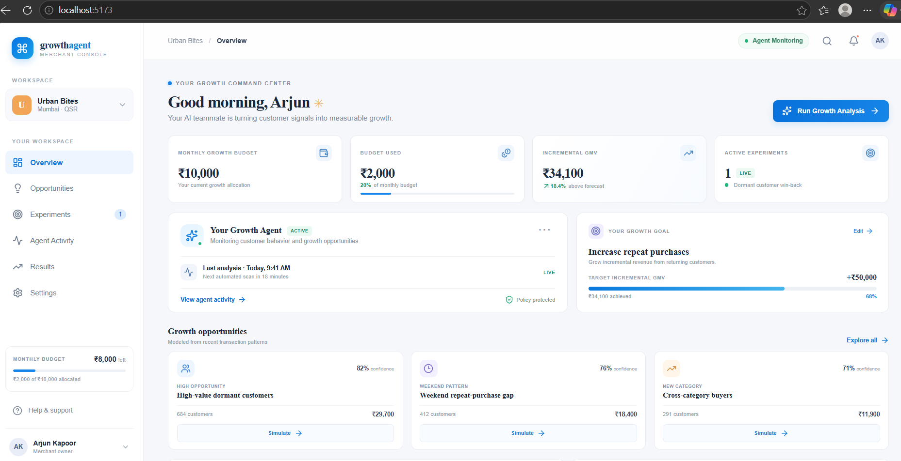
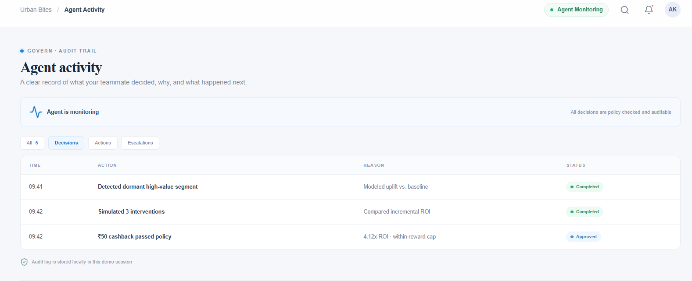
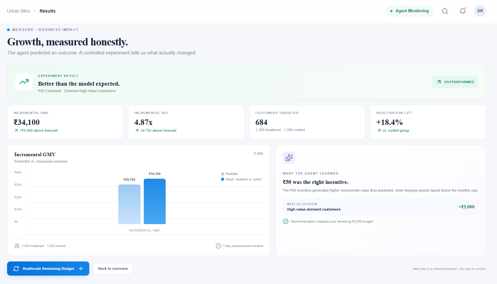

# Paytm Growth Agent

> **An autonomous AI teammate that turns merchant growth goals into measurable outcomes.**

Built for the **Paytm Build for India AI Hackathon — Mumbai Edition**.

## 🚀 What is Paytm Growth Agent?

Paytm Growth Agent is an AI teammate designed for merchants that goes beyond recommendations.

A merchant provides a **growth goal, budget, and constraints**. The agent then:

**Sense → Simulate → Govern → Act → Measure → Learn**

It analyzes transaction behavior, identifies high-potential customer segments, simulates possible interventions, checks merchant-defined policies, executes a growth experiment, measures the outcome, and uses the result to improve future decisions.

## 💡 Core Idea

Instead of:

> "Here are some customers you could target."

The agent works toward:

> "You gave me ₹10,000 to increase repeat purchases. I identified the highest-value opportunity, simulated multiple interventions, selected the safest high-return action, executed the experiment within your limits, and measured the resulting incremental GMV."

<h2>📸 Prototype Preview</h2>

<h3>Merchant Growth Command Center</h3>
<p align="center">
  
</p>

<h3>Autonomous Agent Activity & Audit Trail</h3>
<p align="center">
  
</p>

<h3>Measured Business Outcome</h3>
<p align="center">
  
</p>

## 🔄 Agent Workflow

```text
Merchant Growth Goal
        ↓
Transaction Intelligence
        ↓
Opportunity Detection
        ↓
Customer Uplift / Persuadable Segment
        ↓
Counterfactual Simulation
        ↓
Policy & Risk Governor
        ↓
Campaign / Reward Execution
        ↓
Treatment vs Control Measurement
        ↓
Incremental GMV + ROI
        ↓
Agent Learning & Reallocation


